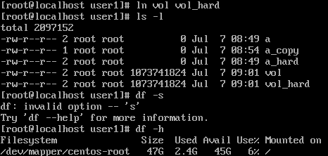

# [Linux] 하드링크와 소프트링크

Linnux에는 
- 소프트 링크
- 하드 링크

## inode란
UFS와 같은 유닉스 계열 파일 시스템에서 사용하는 자료 구조이다. 정규 파일 디렉토리등 파일 시스템에 관한 정보를 가지고 있다.
파일들은 각각 자신들의 inode값을 가지고 있으며, inode는 소유자그룹, 접근모드(읽기, 쓰기, 실행권한), 파일 형태, inode 숫자등에 대한 파일 정보를 가지고 있다. 

OS에서 약 1%에 해당하는 공간을 inode에 할당하기에 파일의 최대 갯수도 한정적이지만. 사용자가 느끼기엔 거의 무한대이다.
> ls -li 

## 하드 링크

> ln 대상파일명 하드링크파일명

동일한 inode값을 가지고있기 때문에 하드 링크 파일을 수정하게 될 경우 원본 파일의 내용또한 수정이 된다. 
> fallocate -l 1G vol 
> df -h

신기한 점은 파일의 리스트 상에는 용량을 차지하는 것을 확인할 수 있다. 하지만 실제 메모리를 확인해보면 변화가 없는 것을 확인해 볼 수가 있다.  
> ln vol vol_hard  
> ls -l   
> df -h

## 소프트 링크

> ln -s 대상파일명 소프트링크파일명

## cp와 하드 링크의 차이 
그렇다면 cp로 복사한 파일과 하드 링크한 파일은 어떠한 차이가 있을까? 

하드 링크를 건 파일의 경우에는 동일한 inode값을 가지고 있는 것을 볼 수 가 있다.

> cp a a_copy

하지만 복사한 파일의 경우에는 inode값 자체가 다른 것을 확인할 수가 있다. 즉 전혀 다른 파일인 것을 의미한다. 

참조:  
https://ndb796.tistory.com/506  
https://ko.wikipedia.org/wiki/%EC%95%84%EC%9D%B4%EB%85%B8%EB%93%9C