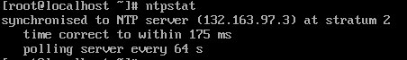

# [Linux] NTP 구성하기 

## Network Time Protocol(NTP) 이란?
네트워크 상에 분산된 시간 서버들로부터 클라이언트(호스트, 라우터)의 동기화이다. 

만약 각기 다른 서버간에 시간이 다르다면 많은 문제가 발생한다. 그렇기에 하나의 NTP서버를 생성하여 서버간의 시간을 연동한다. 하지만 전세계의 서버들이 하나의 ntp서버에 연결을 하게되면 과부하로 가버릴 것이다. 그렇기에 계층 형태의 구조로 하부 서버에서 시간 동기화를 하고 이를 요청한다(트리 형태와 비슷하다)  
원자시계(Stratum0) → NTP Server(Stratum 1) → NTP Server(Stratum 2) -> 내부망서버(Stratum 3) -> 클라이언트

## NTP 특징
- UDP기반 통신
- Client/Server 구조 

## Stratum 2의 서버 목록
- time.bora.net
- time.nist.gov
- kr.pool.ntp.org

## 설치 과정 
1. 클라이언트 및 서버 
    - yum -y install ntp
2. 서버 vi /etc/ntp.conf
    - #restrict default nomodify notrap noquery 주석처리
        - 설정 IP이외 모든 IP에서 NTP서버 설정 수정 X NTP서버로 쿼리 X ntpq 제어 명령어 사용 X
    - 17번째 줄 내부망 대역대 쿼리 허용
        - restrict 192.168.1.0 mask 255.255.255.0 nomodify notrap
    - 25,26번째 줄 stratum 2로부터 시간을 가져온다
        - server time.bora.net iburst 
        - server time.nist.gov iburst
        - iburst는 Stratum2와 내부 NTP 서버 차이가 5분이상 날 경우 동기화를 할 수 있도록 만들어주는 옵션 
3. systemctl restart ntpd
4. ntpq -p 
    - NTP 서버의 동기화 여부 확인 
    - *192.168.100.130  
        - *이 있다면 잘 연동 의미
        - +는 연동을 진행할수 있는 상태 이미 연동된 서버가 존재하여 연동을 진행하지 않는다
    - st
        - stratum 레벨 
    - refid
        - 서버가 시간 정보를 참조하는 상위 NTP 서버를 의미 
    - t
        - Unicast, Mulicast, Brodcast 중 하나를 의미
    - when
        - NTP서버와 동기화 이후 지난 시간
    - poll
        - NTP서버에 쿼리는 날리는 빈도수 64초에 1번
    - reach
        - 동기화 성공 여부 8진법 표기
            - 0~377이면 정상
    - Delay와 Offest 
        - 시간 차이를 표시하는 필드
        - Delay는 NTP로 동기화된 클라이언트 시간과 실제 NTP 서버의 시간 차이*2 
        - Offset은 NTP 시간과 하드웨어 시간의 차이 
    - Jitter
        - 네트워트킈 대기 시간 변동을 측정한 것 대기 시간이 일정하면 지터가 없다
5. 클라언트 vi /etc/ntp.conf
    - server 서버IP iburst
6. 클라이언트 systemctl restart ntpd

- ntpstat 현재 리눅스 시스템에서 NTP 연동 상태 확인

- Stratum 3 서버 동기화 확인

- ntpdate: 시간을 보정한다 최신화한다

## NTP 작동 원리  

클라이언트가 시간동기화를 요청하는 쿼리 패킷을 상위 NTP 서버에 보낸다. 이 패킷을 Request 패킷이라 한다. NTP 서버에서 클라이언트로부터 전달받은 Requset 패킷에 대한 답신으로 Transmit 패킷을 돌려준다. 이 Transmit 패킷의 내용을 토대로 클라이언트는 사긴을 보정하는 작업을 한다 .

## 연동 과정 문제
- NTP는 UDP/123번 포트를 사용한다. 123번 포트를 막고있는 정책이 있다면 풀어준다.
- 방화벽을 꺼준다.
- Chrony가 실행중이라면 꺼준다.

> Centos7까지는 NTP와 Chrony 중 선택이 가능하지만 Centos8부터는 Chrony가 기본값으로 되어있다. 

참조:  
http://www.ktword.co.kr/test/view/view.php?m_temp1=2106  
https://whitewing4139.tistory.com/132?category=1056250   
https://whitewing4139.tistory.com/137?category=1056250  
https://s-core.co.kr/post_os/%EC%84%9C%EB%B2%84-%EC%8B%9C%EA%B0%84-%EB%8F%99%EA%B8%B0%ED%99%94-%EB%B0%A9%EB%B2%95/